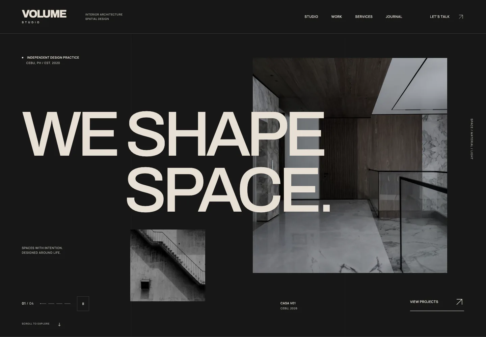

# VOLUME Studio

**0.3.0** · Interior architecture / Spatial design

An original, image-led website for a fictional independent design practice. Oversized grotesk typography, warm architectural photography and exposed grids connect a dark canvas with bone-colored editorial sections.



[Mobile preview](docs/previews/home-mobile.webp)

## Run

Node 22.12+ and npm are required. Optimized media is included; ffmpeg is needed only to regenerate video/audio.

```sh
npm ci
npm run dev
```

Open the URL printed by Vite. Production:

```sh
npm run build
npm run preview
```

## Implementation

React 19, TypeScript 6, Vite 8 and React Router 7. Native CSS/observer/animation APIs handle motion. Vitest, Testing Library, Playwright and axe handle verification. TypeScript/ESLint versions follow their plugins' supported peer ranges; exact versions are locked.

Architecture: **repository → service → hooks → UI**. Typed local repositories hold projects, articles, services and media metadata. Services resolve/filter content and validate inquiries. Hooks expose state to composed, responsive route views. Maison Vielle supplied technical reference for local media and restrained native motion.

Routes: `/`, `/studio`, `/services`, `/work`, `/work/:slug`, `/journal`, `/journal/:slug`, `/contact`, plus a custom 404. Four project studies and three articles are included. Build-time rendering emits route-specific HTML and SEO metadata for static hosting.

## Features

- Cinematic hero with staggered image-first entrances that carry the header with them, opposing pointer depth and an automatic, pausable project slideshow.
- Scroll storytelling with masked typography, image depth, an expanding film section, one desktop horizontal gallery and mobile swipe alternative.
- Filtered project index, visual case studies and large next-project previews.
- Expandable services, keyboard-operated process tabs with architectural assembly and completed-interior drawings and editorial journal.
- Fullscreen accessible mobile menu, live reduced-motion support, silent viewport-aware film and explicit sound opt-in.
- Validated inquiry details produce a downloadable brief. **Nothing is emailed or submitted.**
- Local AVIF/WebP at five widths, 720p WebM/MP4, compressed MP3 and self-hosted variable fonts.

## Scripts

| Command | Purpose |
| --- | --- |
| `npm run dev` | Local development |
| `npm run build` / `preview` | Typecheck, bundle, prerender / inspect production |
| `npm run typecheck` / `lint` | Static checks |
| `npm run test` / `test:watch` | Unit and component tests |
| `npm run test:coverage` | Enforce 100% core service coverage |
| `npm run test:e2e` | Production browser flows, responsive and axe checks |
| `npm run media:optimize` | Regenerate AVIF/WebP and dimension metadata |
| `bash scripts/optimize-video.sh` | Regenerate local video, poster and audio |
| `npm run media:inspect` | Validate all optimized media |
| `npm run version:check` | Check version files agree |
| `npm run release:tag` | Preview the local release-tag command |
| `npm run audit:performance` | Mobile/desktop Lighthouse against production preview on port 4174 |

Install the browser once with `npx playwright install chromium`. The e2e suite starts a production preview on port 4174. [Verification results](docs/verification.md) distinguish measured checks from untested environments.

## Customize and deploy

- Content: `src/repositories/`; public settings: `src/config/site.ts`.
- Layouts, pages and sections: `src/ui/`; design and motion: `src/ui/styles/index.css` and `src/ui/styles/motion.css`.
- Set `VITE_SITE_URL` to a real origin before building; `.env.example` documents it. Never put secrets in client variables.
- Publish `dist/` using static clean-URL rules and a genuine 404 response. [Deployment guide](docs/deployment.md).
- Media credits/licenses: [sources](docs/media-sources.md). Stock media illustrates fictional projects; replace demonstration claims for a real practice.
- Accessibility and performance: [accessibility](docs/accessibility.md), [performance](docs/performance.md).

[Architecture](docs/architecture.md) · [Structure](docs/project-structure.md) · [Design system](docs/design-system.md) · [Motion](docs/motion-system.md) · [Media pipeline](docs/media-pipeline.md) · [Testing](docs/testing.md)

## Versioning and AI handoff

Semantic versioning begins at 0.1.0. Keep `package.json`, its lockfile, `VERSION`, `CHANGELOG.md` and `.agent/PROJECT_STATE.md` consistent. Local tags use `v0.3.0`; no remote release is automatic.

Before AI-assisted changes, read `.agent/PROJECT_STATE.md` and `.agent/DECISIONS.md`, inspect relevant source, make the change, run tests, then update state and `.agent/CHANGELOG.md`.
